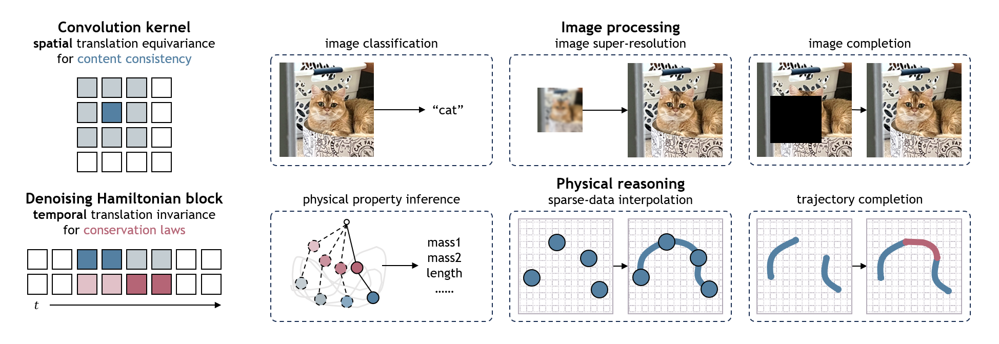

# Denoising Hamiltonian Network for Physical Reasoning

[Congyue Deng](),
[Brandon Y. Feng](),
[Cecilia Garraffo](),
[Alan Garbarz](),
[Robin Walters](),
[William T. Freeman](),
[Leonidas Guibas](),
[Kaiming He]()

[**Paper**](https://arxiv.org/pdf/2503.07596) | [**Project**](https://cs.stanford.edu/~congyue/dhn/)



\
This repository contains the full code for all experiments in the paper, including various configurations and flags. For a simpler version with minimal implementation to help you get started quickly, check out [**this repo**](https://github.com/FlyingGiraffe/dhn).

## Data Preparation

Download the data from [**Google Drive**](https://drive.google.com/file/d/1ry6Lz1Wa77UZmApEghfm9aSydXU2vWWr/view?usp=sharing) and upzip it to the folder `data` into the following format:
```
data/
 ├── single_pendulum/
 │     ├── train/
 │     └── test
 └── double_pendulum/
       ├── train/
       └── test
```

You can also generate the data yourself by running
```
bash scripts/data_gen_train.sh
bash scripts/data_gen_test.sh
```
Change the variable `DATA_NAME` to generate simulated data for different physical systems (`single_pendulum` or `double_pendulum`).

## Experiments

Change the variables in the scripts to run different experiments:
- `EXP_CLASS` for different tasks: `ar` for forward simulation (autoregression and completion), `repn` for representation learning, and `superres` for trajectory interpolation (super-resolution).
- `EXP_NAME` for different config files.

All experimental results, including logs and checkpoints, will be under the directory `results/${EXP_CLASS}/${EXP_NAME}`.

### Forward Simulation

**Fitting known trajectories**\
Step 1: Run `train.sh` with `EXP_CLASS=ar`.\
Step 2: Run `generate.sh` with `EXP_CLASS=ar`.\
The generated sequences will be in a subfolder named `gen_sequence`.

**Completion on novel trajectories**\
Step 1: Run `train.sh` with `EXP_CLASS=ar`.\
Step 2: Run `extract_partial.sh` with `EXP_CLASS=ar`.\
Step 3: Run `generate_partial.sh` with `EXP_CLASS=ar`.\
The generated sequences will be in a subfolder named `extract/gen_sequence`.

### Representation Learning
Step 1: Run `train.sh` with `EXP_CLASS=repn`.\
Step 2: Run `extract.sh` with `EXP_CLASS=repn`.

### Trajectory Interpolation (Super-Resolution)
Step 1: Run `train.sh` with `EXP_CLASS=superres`.\
Step 2: Run `extract.sh` (for in-distribution trajectories with the same initial states) or `extract_ood.sh` (for out-of-distribution trajectories with different initial states) with `EXP_CLASS=superres`.

## License
MIT License